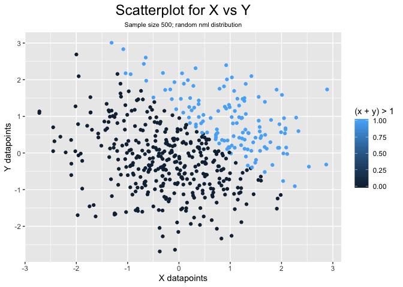
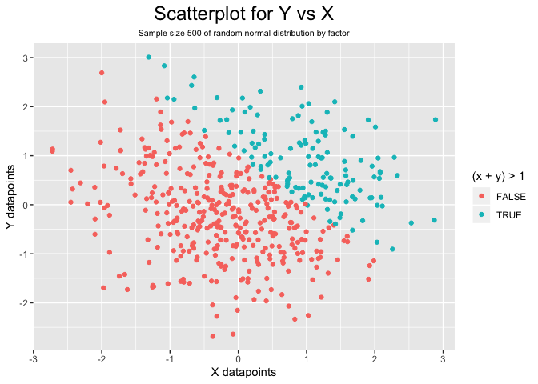

Homework 1 - P8105/Data Science I
================
Kevin S.W.
9/12/2019

# **Introduction**

This is an R-Markdown document for P8105 Homework 1. Tidyverse was
loaded through a chunk with `include = FALSE, message = FALSE, warning =
FALSE`.

# Problem 1

## *Problem 1.a*

Data frame containing the variables as commented.

``` r
# Seed used for reproducibility
set.seed(2)


# Creates a data-frame that is composed of vectors below
prob1_df <- tibble(
  df_sample = rnorm(8),                              # Vector for random normal-distributed sample of size 8
  df_vec_logic = df_sample > 0,                      # Logical vector that evaluates if elements in sample > 0
  df_vec_char = c("GitHub", "is", "super",           # Character vector with 8 variables ("length == 8")
               "interesting", "and", "awesome", 
               "I", "can't even..."),
  df_vec_fac = factor(c("corn", "not corn", "corn",  # Factor vector size 8 with 3 levels: "corn", 
              "maybe corn", "corn", "maybe corn",    # "maybe corn", "not corn"
              "corn", "not corn"))
)


# Pulls vectors inside prob1_df and turns it into usable variables outside
# Inconvenient but makes downstream access to these vectors easier
# Using prob1_df$vector was considered bad syntax and was not utilized
sample <- pull(prob1_df, df_sample)
vec_logic <- pull(prob1_df, df_vec_logic)
vec_char <- pull(prob1_df, df_vec_char)
vec_fac <- pull(prob1_df, df_vec_fac)


# Takes the mean for each vectors
mean(sample)
```

    ## [1] 0.03322869

``` r
mean(vec_logic)
```

    ## [1] 0.5

``` r
mean(vec_char)
```

    ## Warning in mean.default(vec_char): argument is not numeric or logical:
    ## returning NA

    ## [1] NA

``` r
mean(vec_fac)
```

    ## Warning in mean.default(vec_fac): argument is not numeric or logical:
    ## returning NA

    ## [1] NA

Taking the mean of sample worked as expected as it is a continuous
variable. Logical vector surprisingly outputs mean of 0.5. Mean for
`vec_char` & `vec_fac` however, does not work. This is likely because
characters are not read as “numbers” and therefore cannot be
mathematically manipulated.

## *Problem 1.b*

Applying the `as.numeric()` function to logical, character, and factor
variables:

``` r
# Assesses each vectors as a numeric i.e. coercion?
as.numeric(vec_logic)
as.numeric(vec_char)
as.numeric(vec_fac)
```

The command coerces a numeric value that represents each element in the
vectors. `vec_logic` seems to indicate that `FALSE` = 0 while `TRUE` =
1, which leads to 4/8 TRUE, hence the calculated mean earlier.

Character vector shows NA indicating that it doesn’t have a numeric
representation.

Factor vectors however, has the value 1-3; this does not explain why
factor vectors cannot output a mean. In the following code chunk, we
explore this
peculiarity:

``` r
as.numeric(vec_logic) * sample      # Convert logical vector to numeric then multiplied with sample
```

    ## [1] 0.0000000 0.1848492 1.5878453 0.0000000 0.0000000 0.1324203 0.7079547
    ## [8] 0.0000000

``` r
as.factor(vec_logic) * sample       # Convert logical vector to factor then multiplied with sample
```

    ## Warning in Ops.factor(as.factor(vec_logic), sample): '*' not meaningful for
    ## factors

    ## [1] NA NA NA NA NA NA NA NA

``` r
as.numeric(as.factor(vec_logic)) * sample # Convert logical vector to factor then numeric then multiplied                                                       with sample
```

    ## [1] -0.89691455  0.36969837  3.17569066 -1.13037567 -0.08025176  0.26484057
    ## [7]  1.41590946 -0.23969802

Based on results, we can guesstimate that `factor()` stores elements as
characters categorized based on the “levels”. When we coerce it into
numeric, it labels the elements based on the levels’ numeric value.
Since it holds a number, we can then operate on the factor as “numbers”.
We also notice that when we double-coerced `FALSE`, it’s assigned 1
instead of 0 as in logical vectors, which indicates that a factor’s
lowest “numeric” is 1.

# Problem 2

## *Problem 2.a*

Data frame for problem 2.

``` r
# Data frame consisting of commented vectors
prob2_df <- tibble(
  df_x = rnorm(500),                   # Vector 1 of random normal distribution sample; size 500 
  df_y = rnorm(500),                   # Vector 2 of random normal distribution sample; size 500 
  df_xy_logic = (df_x + df_y) > 1,     # Logical vector; evaluates argument: x + y > 1
  df_xy_num = as.numeric(df_xy_logic), # Vector from coercing xy_logic to a numeric vector
  df_xy_fac = as.factor(df_xy_logic)   # Vector from coercing xy_logic to a factor vector
)


# pulls variable from prob2_df out of the df so it's usable outside
x <- pull(prob2_df, df_x)
xy_logic <- pull(prob2_df, df_xy_logic)
xy_num <- pull(prob2_df, df_xy_num)
xy_fac <- pull(prob2_df, df_xy_fac)
```

The `prob2_df` dataframe is a dataset of 2500 points in a grid of 500
rows x 5 columns. Columns contain values for `x`, `y`, `xy_logic`,
`xy_num`, and `xy_fac`.

The `x` column has a mean of 0.062682, median of 0.0439172, and standard
deviation of 1.0322115.

The proportion of `TRUE` cases where `(x + y) > 1` is 134/500, which is
26.8%.

## *Problem 2.b*

Making a scatterplot of `y` vs. `x` and applying conditional color based
on `xy_logic`, `xy_num`, or `xy_fac`.

``` r
# ggplot of y vs x; by logic
ggplot(data = prob2_df, aes(x = df_y, y = df_x, color = df_xy_logic)) + 
  geom_point() +
  labs(title = "Scatterplot for Y vs X", 
       subtitle = "Sample size 500; random nml distribution",
       x = "Y datapoints",
       y = "X datapoints",
       color = "(x + y) > 1") +
  theme(plot.title = element_text(hjust = 0.5, size = 18),
        plot.subtitle = element_text(hjust = 0.5, size = 8))
```

<!-- -->

``` r
# ggplot of y vs x; by numeric
ggplot(data = prob2_df, aes(x = df_y, y = df_x, color = df_xy_num)) +
  geom_point() +
  labs(title = "Scatterplot for Y vs X", 
       subtitle = "Sample size 500; random nml distribution",
       x = "Y datapoints",
       y = "X datapoints",
       color = "(x + y) > 1") +
  theme(plot.title = element_text(hjust = 0.5, size = 18),
        plot.subtitle = element_text(hjust = 0.5, size = 8))
```

<!-- -->

``` r
# ggplot of y vs x; by factor
ggplot(data = prob2_df, aes(x = df_y, y = df_x, color = df_xy_fac)) +
  geom_point() +
  labs(title = "Scatterplot for Y vs X", 
       subtitle = "Sample size 500; random nml distribution",
       x = "Y datapoints",
       y = "X datapoints",
       color = "(x + y) > 1") +
  theme(plot.title = element_text(hjust = 0.5, size = 18),
        plot.subtitle = element_text(hjust = 0.5, size = 8))
```

<!-- -->

Evaluating these 3 graphs, we can see that all of them seems to be
similar. Both ggplot by logic and by factor shows the same, discrete
legends of `FALSE` and `TRUE`. ggplot by numeric however, shows a
continuous gradient from 0 to 1. This is likely because it evaluates
numeric as continuous variable. The plot however, shows 2 colors only
likely because we evaluated the logical variable (which only contains 0,
1).
